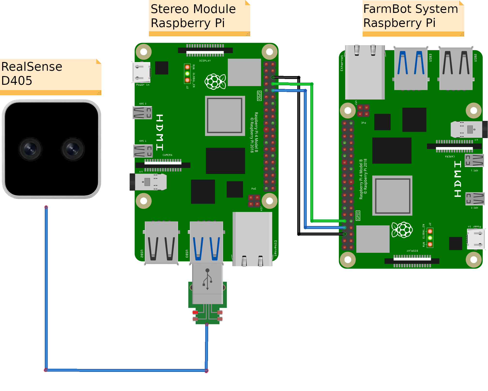

# List of Materials
- Any [FarmBot](https://farm.bot/)
- [Raspberry Pi 4b 8GB](https://www.raspberrypi.com/products/raspberry-pi-4-model-b/?variant=raspberry-pi-4-model-b-8gb) - not the one from the FarmBot, but a different one
  - Raspberry Pi Mount (see [here](https://a.co/d/2Kd7VHw) for a waterproof container)
  - micro-SD 64GB
  - Any power supply for the Raspberry Pi like the USB-C supply.
- [Intel Realsense D405](https://www.intelrealsense.com/depth-camera-d405/)
  - Long USB cable (D405 needs a [Micro B](https://amzn.eu/d/33nk2e9)) for the camera. Should be at least 2m for a 1.5m FarmBot.
  - Camera Mount (see [`printing_files/`](printing_files/))
- External SSD (with USB connector) for saving all depth images.
- Cable to connect the Raspberry Pi UART
  - Ex: female to female jumper wire
  - Length is dependent on your mount location of the Raspberry Pi

# Setup

1. Build the FarmBot
   - While adding the cables to the cable carries of the cross-slide and z-axis, also add the USB cable to the carries.
2. Add the camera to the main gantry using the camera mount.
   - It should face downward. It can have an offset.
   - Connect the camera to the USB cable previously installed.
3. Add the Raspberry Pi with its mount.
4. Connect the Raspberry Pi to the USB cable and to the PSU.
5. Connect the Raspberry Pi to the Raspberry Pi in the electronics box of the FarmBot via UART.

6. Install any OS on the micro-SD card (Raspian is recommended).
7. Put the micro-SD card into the Raspberry Pi.
8. Connect the external SSD to the Raspberry Pi.
9. Connect the Raspberry Pi to its power supply.
10. Mount the SSD ([see](https://raspberrypi-guide.github.io/filesharing/mounting-external-drive)).
11. Follow the software installation instruction in [`reconstruction_system/`](reconstruction_system/) and [`farmbot_files`](farmbot_files/).